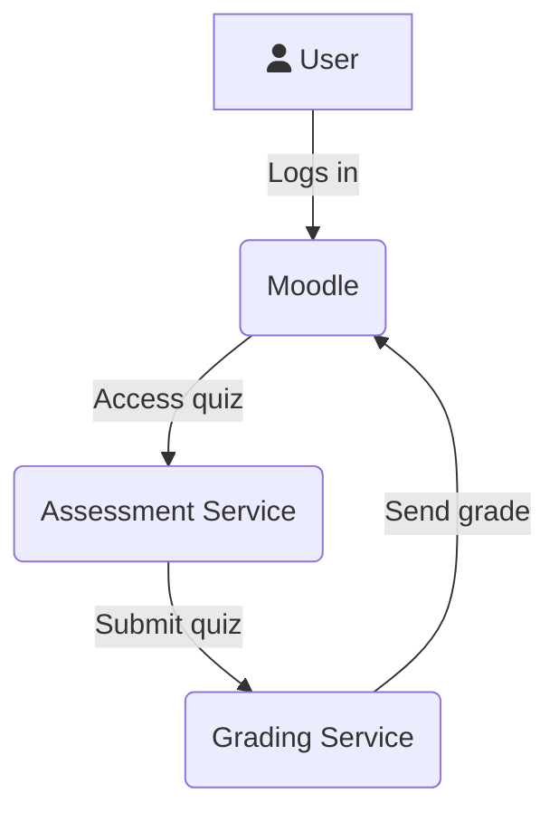

# What is it?
A proof of concept assessment microservice to run alongside an LMS like Moodle and take some of the load off when it comes to heavy usage of quizzes.

# Why? What's the problem you're trying to help with?
Big Moodles can grind to a halt and suffer performance issues on exam day when hundreds/thousands of students all try to load up and submit quizzes at the same time. Some improvements are being made internally in Moodle, but it's still a very performance-heavy area.

The idea is, that by completely bypassing it to microservices, you push most of that load off the main Moodle site, and you can then scale the microservices independently without having to scale the whole site.



# Aren't there already services we can use to do this?
Yes. But all the ones I've seen are paid services. The idea here is to be an open source microservice you could run yourself alongside your Moodle. Though, obviously microservices add complexity, so you'd need to be comfortable with how to manage/scale/update/etc... them.

# Okay but Moodle has loads of question types and grading/feedback options, etc... Wouldn't it be a massive undertaking to re-create it in a microservice?
Yes and no. Firstly, it wouldn't have to be an all or nothing, it could be done iteratively. Secondly, it wouldn't be as hard as it sounds, as because it's a brand new service, we're not restricted by Moodle's framework and we can develop very differently.

# Notes
- Obviously this is a very simple proof of concept with no real security or validation, don't try to use this for anything real.
- Being that it's based on microservices, tech stack can be anything. I've chosen PHP for the assessment service and Ruby for the grading service, just as an example to show how different technologies could interact.
- This uses LTI 1.0/1.1 as it was easier to do for the PoC
- For the ease of the PoC this uses a single conversation. So the assessment service sends the data to the grading service, then waits for the response. In reality, this would be a 2-part conversation, so avoid that wait time.

## Walkthrough video
[](https://www.youtube.com/watch?v=dMSRVgMKRVg)

## Steps to try it out
1. Clone down the repo and check out all submodules
2. Create the docker network `docker network create poc-network`
3. Run `docker compose up -d` to start all containers
4. Install the laravel application on the assess container:
5. Install composer packages: `docker exec -it poc-assess composer install`
6. Then run the database migrations and seed the database with the example quiz `docker exec -it poc-assess php artisan migrate:fresh --seed`
7. Visit https://assess.poc.localhost/lti and accept the self-signed cert warning. You should now see "invalid consumer key". That's fine. Just making sure the app is working.
8. Now onto Moodle:
9. Run the moodle install on the container:
   ```bash
    docker exec -it poc-moodle php /app/admin/cli/install_database.php --agree-license --adminemail=admin@admin.admin --adminuser=admin --adminpass=password
   ```
10. Visit https://moodle.poc.localhost and login with username `admin`, password `password`. (Accept the ERR_CERT_AUTHORITY_INVALID warning, it's because of self-signed certificate from Caddy).
11. Go to Site Admin -> Plugins -> External Tool -> Manage Tools
12. Click "Configure a tool manually"
13. Enter the following values in the form:
   ```
   Tool Settings
   ---
   Tool Name: Assessment Service
   Tool URL: https://assess.poc.localhost/lti
   LTI Version: 1.0/1.1
   Consumer Key: fox
   Shared Secret: dog
   Tool configuration usage: Show in activity chooser as a preconfigured tool
   
   Services
   ---
   Grade Services: use this service for grade sync only
   ```
14. Create a course: `docker exec -it poc-moodle php /app/admin/tool/generator/cli/maketestcourse.php --size=S --shortname=Test`
15. Visit the course (CLI will give you the link) and turn editing on, then add Activity -> "Assessment Service"
16. Enable "Allow Assessment Service to add grades in the gradebook" in the activity settings 
17. Give it a maximum grade of 5 for this example, though it doesn't matter as it's not checked properly in this PoC. 
18. Save it 
19. Go to Participants list and login as one of the students on the course 
20. Click the assessment activity (You might need to bypass the self-signed cert warning again)
21. You should see an example quiz with 3 different question types. Fill it out and submit your answers.
22. To simulate a scheduled job running in the background, manually run the job to send the data from the assessment service to the grading service: `docker exec -it poc-assess php artisan queue:work`. Once it's "DONE" you can stop the job (CTRL+C), or it'll just keep running forever.
23. That has sent the answers to the grading service, which has calculated your score and sent it back to Moodle. (Logs in /assess/storage/logs/laravel.log)
24. Return to the course page and go to Grades tab.
25. You should now see your grade for that assessment.

---

That is the general gist of it. Might be worth exploring. Might not.